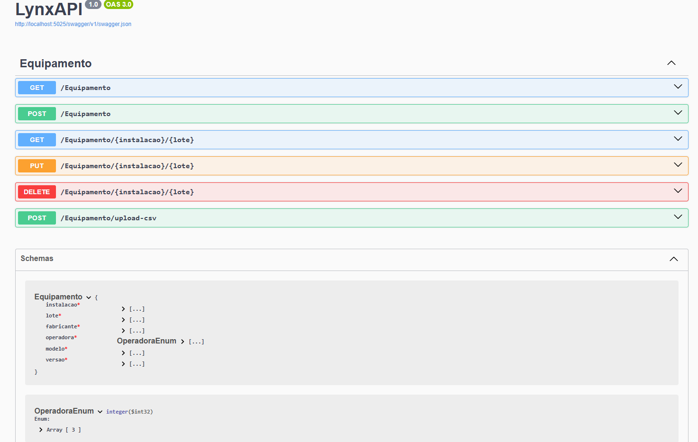
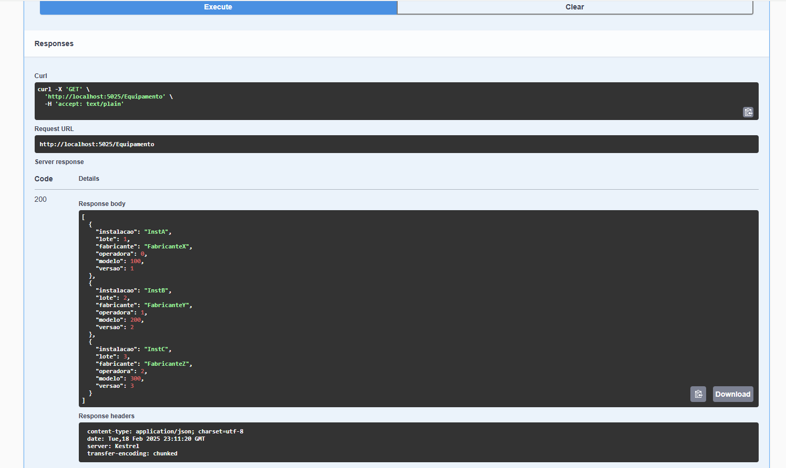
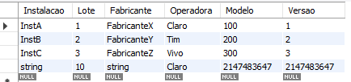
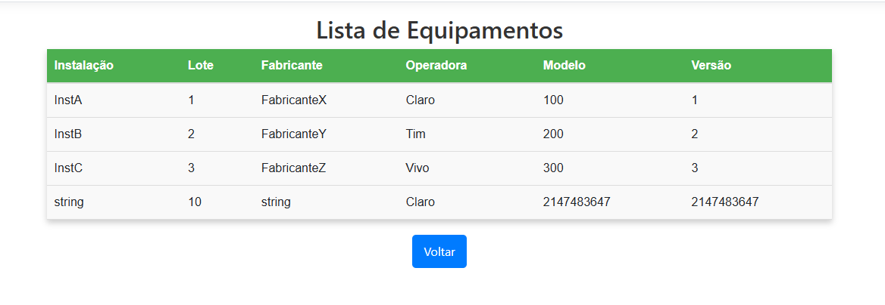

# Explicação da aplicação

## API Back-End

Para esse projeto, optei por uma API simples, criada em .NET 8 para fazer a comunicação com o banco, utilizando o modelo MVC do ASPNET como Front, a fim de separar o projeto em módulos e tornar mais fácil identificar eventuais gargalos. Podemos ver uma breve documentação na imagem a seguir do Swagger.

Nessa API exponho os endpoints. É possível visualizar no controlador da aplicação, a classe EquipamentoController. Veja o GetAll funcionando

Outra informação importante sobre o back-end é a migração. Utilizei o migration do Entity Framework por ser uma boa prática de versionamento no banco de dados. Além disso, importante citar o fato de não ter sido um tratamento adequado para o enum que caracteriza as operadoras, mas que não prejudica o banco.

## Front-end

Para front-end, utilizei a arquitetura ASPNET MVC. Essa arquitetura utiliza 3 camadas: Modelo, View e Controle. O Modelo é a entidade que é persistida no banco. View representa a página visualizada de fato. O Controle, no caso a classe HomeController, é responsável por fazer contato com a API do back-end, para que faça as operações necessárias nos seus respectivos endpoints. Para atender aos requisitos de histórico e logs, foram criados dois métodos privados, que são chamados nas operações de CRUD que os exigem. Esses métodos se encontram na própria classe HomeController. Duas Views além da página principal foram criadas. Elas foram necessárias para visualização dos métodos de verbo GET. 

